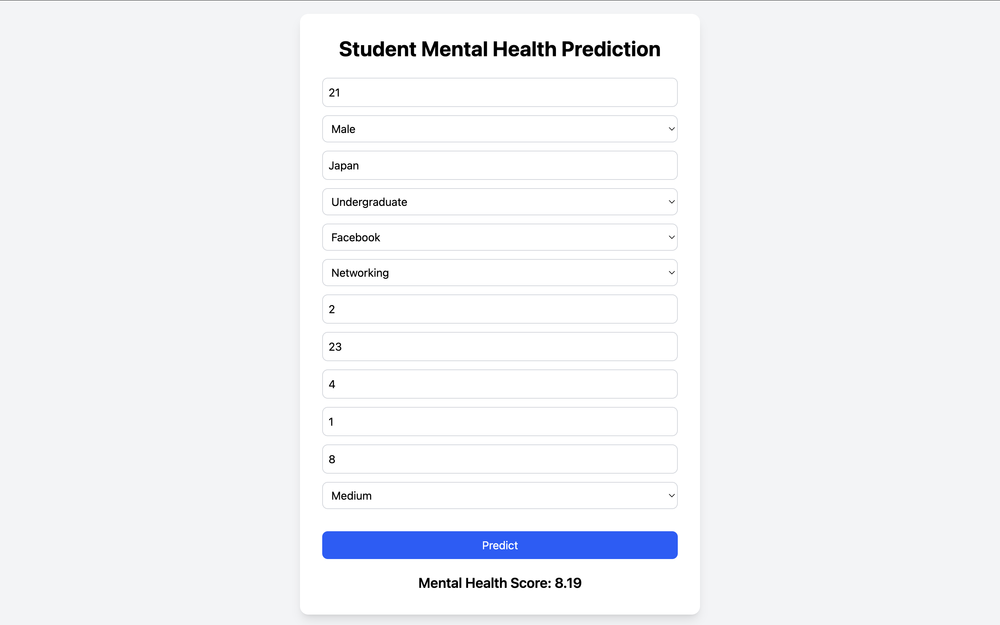

# Student Mental Health Score Predictor

A full-stack Machine Learning web application that predicts a student's mental health score based on demographic, academic, social media, lifestyle, and stress-related factors.

---

## 🌐 Live Demo

**Frontend:** https://student-mental-health-score-predictor-1.onrender.com

**Backend API:** https://student-mental-health-score-predictor.onrender.com

---

## Screenshot

---

## Tech Stack

### Frontend

* React
* Vite
* Tailwind CSS

### Backend

* Python
* FastAPI
* Pydantic

### Machine Learning

* Scikit-learn
* Pandas
* NumPy
* Matplotlib
* Seaborn
* Joblib

### Deployment

* Render

---

##  Features

* Predicts a student's mental health score instantly.
* User-friendly React interface.
* FastAPI REST API for model inference.
* Input validation using Pydantic.
* Fully deployed on Render.

---

## 🤖 Machine Learning Model

**Problem Type:** Regression

**Final Model Used in the Web Application:** Random Forest Regressor (Default)

### Model Performance

| Model                         |      MAE ↓ |     RMSE ↓ | R² (Test) ↑ |
| ----------------------------- | ---------: | ---------: | ----------: |
| Linear Regression             |     0.5362 |     0.6760 |      0.7398 |
| **Random Forest (Default)** ⭐ | **0.3472** | **0.4637** |  **0.8776** |
| Random Forest (Tuned)         |     0.3486 |     0.4650 |      0.8769 |

The default Random Forest model was selected for deployment because it achieved the best performance on the test dataset, outperforming both Linear Regression and the tuned Random Forest model.
